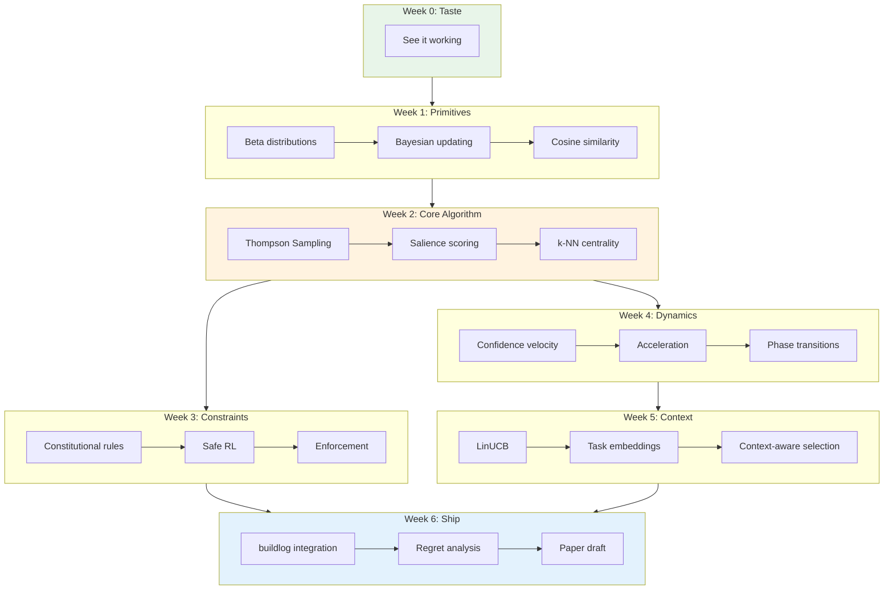

# Emergent Salience: RL-Backed Rule Hierarchies

**Your intuitive rule system is a special case of my contextual bandit formalization.**

This curriculum teaches you to design, implement, and publish adaptive rule systems for AI coding assistants. By the end, you'll ship a working implementation in buildlog-template and have the foundations for an arXiv paper.

---

## The Map



---

## The Arc

```
Week 0   Week 1      Week 2         Week 3        Week 4       Week 5      Week 6
TASTE    PRIMITIVES  CORE           CONSTRAINTS   DYNAMICS     CONTEXT     SHIP
  |         |           |              |             |            |          |
  v         v           v              v             v            v          v
[demo] → [Beta] → [Thompson] → [Constitutional] → [velocity] → [LinUCB] → [paper]
           ↓           ↓              ↓             ↓            ↓
        [Bayes]   [salience]      [safe RL]    [accel]    [task embed]
           ↓           ↓              ↓             ↓            ↓
        [cosine]  [centrality]  [enforcement] [phases]   [pragmatics]
```

**Spiral revisits:**
- Beta distributions: Week 1 (intro) → Week 2 (Thompson) → Week 4 (dynamics)
- Embeddings: Week 1 (refresh) → Week 2 (centrality) → Week 5 (context)
- Regret: Week 2 (intuition) → Week 6 (formal bounds)

---

## Weekly Overview

| Week | Theme | Key Milestone | Sessions | Linguistics Anchor |
|------|-------|---------------|----------|-------------------|
| 0 | Taste the System | See emergent salience working | 1 | — |
| 1 | Probabilistic Primitives | Plot & sample from Beta posteriors | 3-4 | Language acquisition |
| 2 | Thompson Sampling & Salience | Implement `calculate_salience()` | 4-5 | Allophonic variation |
| 3 | Constitutional Rules | Design `constitutional.yaml` | 3-4 | Phonotactics |
| 4 | Learning Dynamics | Measure velocity/acceleration | 3-4 | Grammaticalization |
| 5 | Context-Aware Selection | LinUCB for "which rules apply where" | 4-5 | Pragmatics |
| 6 | Integration & Paper | Ship to buildlog + paper draft | 3-4 | — |

**Total**: ~22-26 sessions × 30 min = **11-13 hours**

---

## Design Principles

### AuDHD Optimizations
- **Working code in first 10 minutes** of every notebook
- **30-min default sessions** (escape at any section boundary)
- **Visible progress** toward buildlog implementation
- **Linguistics "aha" moments** as dopamine hits
- **[OPTIONAL DEPTH]** markers for rabbit holes

### Escape Hatches
Every notebook has clear stopping points:
1. ✅ **Core** — must complete (15-20 min)
2. 🔄 **Extend** — if flow state hits (10-15 min)
3. 📚 **[OPTIONAL DEPTH]** — rabbit hole, skip freely

### Stuck Protocol
1. **Novelty reset**: Switch to adjacent topic
2. **Return later**: Mark and move on
3. **Grind**: Only if 1 and 2 fail

---

## Capstone Track

Each week feeds the buildlog implementation:

| Week | Capstone Contribution |
|------|----------------------|
| 1 | Understand Beta posteriors for rule confidence |
| 2 | Implement `salience.py` core: `calculate_salience()` |
| 3 | Implement `constitutional.yaml` schema + enforcement |
| 4 | Add velocity/acceleration tracking to rule lifecycle |
| 5 | Implement context-dependent rule selection |
| 6 | Integrate into buildlog-template, run experiments, draft paper |

---

## Prerequisites Check

Before starting:
- [ ] Python environment with torch, numpy, matplotlib
- [ ] Familiarity with dataclasses and enums
- [ ] Basic probability (what's a distribution?)
- [ ] Read [buildlog-template issue #15](../../../buildlog-template) for context

**Not required** (we'll cover):
- Beta distributions
- Thompson Sampling
- Contextual bandits
- LinUCB
- Regret bounds

---

## Publishing Artifacts

This curriculum is designed to produce:

1. **Implementation**: `buildlog-template/src/buildlog/salience.py`
2. **Experiments**: Regret curves, learning dynamics plots
3. **Paper draft**: "Emergent Salience: RL-Backed Rule Hierarchies for AI Coding Assistants"
4. **Teaching content**: Notebooks publishable as educational material

---

## Week Guides

| Week | Guide |
|------|-------|
| 0 | [Taste the System](week-00-taste.md) |
| 1 | [Probabilistic Primitives](week-01-primitives.md) |
| 2 | [Thompson Sampling & Salience](week-02-thompson-salience.md) |
| 3 | [Constitutional Rules](week-03-constitutional.md) |
| 4 | [Learning Dynamics](week-04-dynamics.md) |
| 5 | [Context-Aware Selection](week-05-context.md) |
| 6 | [Integration & Paper](week-06-ship.md) |

---

## References

- [Thompson Sampling (Wikipedia)](https://en.wikipedia.org/wiki/Thompson_sampling)
- [Contextual Bandits Survey 2025](https://arxiv.org/html/2505.16918v1)
- [DeepMind Sparrow / RLHF](https://huggingface.co/blog/rlhf)
- [LinUCB](https://dl.acm.org/doi/10.1145/3711896.3737086)
