# Syllabus

A 10-week journey from foundations to research experiments.

---

## The Map

```mermaid
flowchart TB
    subgraph START [" "]
        YOU["🧭 YOU ARE HERE"]
    end

    subgraph FOUNDATIONS ["Week 0-1: Foundations"]
        F["NumPy, PyTorch, LinAlg, Calc"]
    end

    subgraph BUILDING ["Weeks 2-4: Building Blocks"]
        E["W2: Embeddings<br/>Word2Vec, Transformers"]
        I["W3: Information Theory<br/>Entropy, MI, KL"]
        C["W4: Clustering<br/>HDBSCAN, Emergence"]
    end

    subgraph PHYSICS ["Weeks 5-6: Physics"]
        D["W5: Dynamics<br/>Attractors, Phase Space"]
        V["W6: Variational<br/>Least Action, Euler-Lagrange"]
    end

    subgraph GEOMETRY ["Weeks 7-8: Structure"]
        G["W7: Geometry<br/>Manifolds, Geodesics"]
        GDL["W8: GDL<br/>GNNs, Message Passing"]
    end

    subgraph RESEARCH ["Weeks 9-10: Research"]
        INT["Integration<br/>ConceptSpace Prototype"]
        PUB["🎯 Publishable Artifact"]
    end

    YOU --> F
    F --> E & I & C
    E & I --> C
    C --> D & V
    D <--> V
    D & V --> G & GDL
    G <--> GDL
    G & GDL --> INT
    INT --> PUB
```



---

## The Big Picture

```
Weeks 0-1: Foundations     → Environment + Math tools ready
Weeks 2-4: Building Blocks → Embeddings, information, clustering
Weeks 5-6: Dynamics        → How things move and optimize
Weeks 7-8: Geometry + GDL  → Curved spaces and learning on structure
Weeks 9-10: Integration    → Build and experiment
```

**End Goal**: A working prototype of physics-inspired concept space, plus one publishable artifact (blog post, paper, or open-source library).

---

## Weekly Overview

| Week | Theme | Key Milestone | Notebook Count |
|------|-------|---------------|----------------|
| 0 | Onboarding | Environment works, first visualization | 1 |
| 1 | Foundations | Gradient descent from scratch | 3 |
| 2 | Embeddings | Word2Vec + king-man+woman=queen | 3 |
| 3 | Information Theory | MI between concept clusters | 3 |
| 4 | Clustering | Emergent concepts from articles | 3 |
| 5 | Dynamical Systems | 2D attractor landscape | 3 |
| 6 | Variational | Least action on concept space | 3 |
| 7 | Geometry | Geodesics on a sphere | 3 |
| 8 | GDL | Simple GNN working | 3 |
| 9 | Integration | Concept space prototype | 3 |
| 10 | Experiments | Publishable artifact | 3 |

**Total**: ~30 notebooks, ~45 days at 90-120 min/day

---

## ADHD-Optimized Design

### Every Day
- [ ] **Warm-up** (5-10 min): Review previous notebook's key takeaways
- [ ] **Core work** (45-60 min): New notebook, code-heavy
- [ ] **Reflection** (5-10 min): Fill in "What I learned" section
- [ ] **Optional stretch** (15-30 min): Rabbit holes, exercises

### Every Week
- [ ] **Weekly milestone**: Concrete artifact (visualization, working code)
- [ ] **Progress photo**: Screenshot your best output
- [ ] **Quick retrospective**: What worked? What to adjust?

### Escape Hatches
- **Stuck?** → Re-read the wiki primer
- **Bored?** → Skip to the exercises
- **Overwhelmed?** → Do just the "Core Concepts" section
- **Hyperfocusing?** → Set a timer, take a break after 90 min

---

## Publishable Artifact Track

Throughout the curriculum, you'll build toward a publishable artifact:

### Week 2-4: Research Log
Start documenting observations:
- Interesting clustering patterns
- Unexpected embedding behaviors
- Questions that arise

### Week 5-8: Experiment Design
- Formalize one hypothesis
- Design experiment to test it
- Collect preliminary results

### Week 9-10: Write-Up
- Structure findings as blog post or paper
- Create figures and visualizations
- Write for an audience

### Artifact Options

| Format | Audience | Effort |
|--------|----------|--------|
| Blog post | Developers, ML practitioners | Medium |
| arXiv paper | Researchers | High |
| Open-source library | Community | Medium-High |
| Tutorial series | Learners | Medium |

**Recommendation**: Start with a blog post. It's publishable, shareable, and can become a paper later.

---

## Week Guides

| Week | Guide |
|------|-------|
| 0 | [Onboarding](week-00-onboarding.md) |
| 1 | [Foundations](week-01-foundations.md) |
| 2 | [Embeddings](week-02-embeddings.md) |
| 3 | [Information Theory](week-03-info-theory.md) |
| 4 | [Clustering](week-04-clustering.md) |
| 5 | [Dynamical Systems](week-05-dynamical.md) |
| 6 | [Variational](week-06-variational.md) |
| 7 | [Geometry](week-07-geometry.md) |
| 8 | [GDL](week-08-gdl.md) |
| 9 | [Integration](week-09-integration.md) |
| 10 | [Experiments](week-10-experiments.md) |

---

## Prerequisites Check

Before starting:

- [ ] Python 3.11+ installed
- [ ] `uv` package manager installed
- [ ] Basic Python programming (you're an expert, so ✓)
- [ ] Distant memory of linear algebra (we'll refresh)
- [ ] Distant memory of calculus (we'll refresh)

**No prerequisites**:
- Deep learning (we build intuition from scratch)
- Differential geometry (that's what we learn)
- Physics background (helpful but not required)

---

## Time Commitment

**Minimum viable**: 60 min/day → 10 weeks
**Recommended**: 90 min/day → 10 weeks
**Intensive**: 120+ min/day → 7-8 weeks

The curriculum is designed for 90 min/day with built-in flexibility. Some days you'll finish early; some days you'll want to go deeper.

---

## Getting Started

1. Read [Week 0: Onboarding](week-00-onboarding.md)
2. Run `uv sync` to install dependencies
3. Open JupyterLab: `jupyter lab`
4. Complete `notebooks/00-setup/00-environment-test.ipynb`
5. See your first embedding visualization!

**Time to first dopamine hit**: ~15 minutes.
