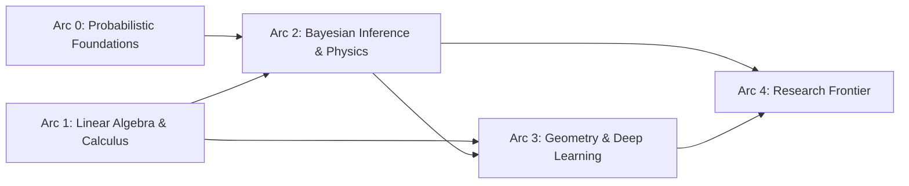

# Aegir Curriculum — Arc-Based Structure

> **v2** — Replaces the week-based syllabus and emergent-salience curriculum. Arcs are completion-gated, not time-gated.

## Design Principles

1. **Completion-gated, not calendar-gated.** An arc is done when you can do the thing, not when a week ends.
2. **Build first, theory second.** Every module starts with implementation, then backfills the math.
3. **AuDHD-optimized.** Short motivation hooks that fire the start engine. Mermaid maps so you always know where you are. Optional depth rabbit holes for hyperfocus sessions.
4. **Publication as forcing function.** Every arc produces artifacts with a named audience. Writing for others is how you find out what you actually understand.
5. **Implementation targets are real.** Exercises produce code that ships — to buildlog, Agno, or standalone repos.

## The Map

**Arc 0** and **Arc 1** can run concurrently. Arc 1 is lighter — it's a revival/fluency arc, not a deep theory arc.

## Arc Overview

| Arc | Title | Prerequisites | Key Deliverables |
|-----|-------|--------------|-----------------|
| 0 | Probabilistic Foundations | None | `engine/statistics.py`, `engine/trials.py`, tutorial series |
| 1 | Linear Algebra & Calculus | None | Numpy fluency, gradient intuition, publishable notebook |
| 2 | Bayesian Inference & Physics | 0, 1 | Statistical Rethinking exercises, LinUCB, Haskell entry |
| 3 | Geometry & Deep Learning | 1, 2 | Information geometry tooling, Needham exercises |
| 4 | Research Frontier | 2, 3 | Category theory foundations, variational inference on manifolds |

## Publication Cadence

Each arc has explicit publication checkpoints. Types range from tweet-sized insights to conference-track material:

- **Tweet/LinkedIn**: Quick insights, counterintuitive findings, "here's what everyone gets wrong" hooks
- **Tutorial/Blog**: Multi-part series tied to buildlog docs
- **Code**: Shipped PRs, released features, open-source artifacts
- **Technical/HN**: Longer-form pieces for practitioner audiences
- **Research**: Arc 4 material, venue TBD based on what the work produces

## Lineage

This structure absorbs and unifies:
- **Main syllabus weeks 0–10** (v1, now in `syllabus/week-*.md`, marked superseded)
- **Emergent-salience weeks 0–6** (v1, now in `syllabus/emergent-salience/`, marked superseded)

Linguistics anchors, notebook references, salience formulas, and dynamics tracker content from emergent-salience are preserved in Arc 0 and Arc 2.
