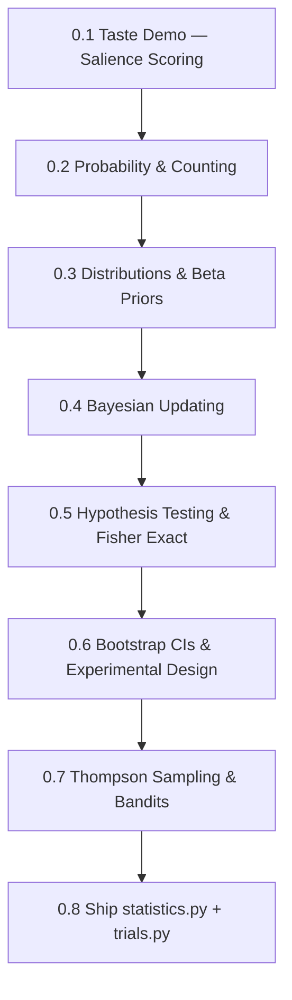

# Arc 0: Probabilistic Foundations

**Destination**: You can design experiments, compute bootstrap CIs, run Fisher exact tests, explain Thompson Sampling from first principles, and ship `engine/statistics.py` + `engine/trials.py` in buildlog.

**Prerequisites**: None

**Estimated sessions**: 12–20

## The Map

## Modules

### Module 0.1: Taste Demo — Salience Scoring

> *Absorbed from emergent-salience weeks 0–1: taste demo, salience formula, constitutional rules*

- **Motivation**: You already have a bandit. But you're evaluating rules with `contains` checks. That's not science — that's string matching cosplay. Let's build something that actually measures salience.
- **Implementation**: Build a minimal salience scorer that combines:
  - Linguistic signal (does the rule's vocabulary appear in the agent output?)
  - Structural signal (did the output follow the rule's prescribed pattern?)
  - Outcome signal (did the task succeed?)
  - Salience formula: `S = w_l * linguistic + w_s * structural + w_o * outcome` with learned weights
- **Theory backfill**: Why weighted linear combinations? What assumptions are we making? (Linearity, independence — both wrong, both useful as a starting point)
- **Exercises**:
  1. Implement `SalienceScorer` class with configurable weights
  2. Run it against 10 buildlog entries, compare to your intuitive ratings
  3. **[PUBLISH]** Write up the "contains check takedown" — why substring matching fails for agent evaluation
- **Constitutional rules** (from emergent-salience):
  - Every scoring function must have a falsifiable claim
  - Weights must be updatable from data, not hardcoded forever
  - If you can't explain what a score of 0.7 means in plain English, the scorer isn't ready

### Module 0.2: Probability & Counting

- **Motivation**: You'll need this vocabulary for everything that follows. The goal isn't to memorize formulas — it's to build intuition for "how surprised should I be?"
- **Implementation**: Write a `probability.py` module with:
  - Combinatorial functions (n choose k, permutations)
  - Joint, marginal, conditional probability from frequency tables
  - Bayes' theorem calculator with worked examples
- **Theory backfill**: Kolmogorov axioms. Why probability is about consistent belief assignment, not just frequency counting.
- **Exercises**:
  1. Calculate P(rule is good | it helped in 3/5 trials) from scratch
  2. Build an interactive conditional probability explorer
  3. Solve 5 "paradox" problems (Monty Hall, birthday, Simpson's) to calibrate intuition

### Module 0.3: Distributions & Beta Priors

> *Absorbed from emergent-salience weeks 1–2: Beta priors, distribution gallery*

- **Motivation**: You've been using `Beta(3,1)` and `Beta(1,1)` in buildlog. Do you actually know why those numbers? By the end of this module, you'll be able to justify every prior you set.
- **Implementation**: Extend buildlog's `BetaParams` class with:
  - Distribution visualization (PDF, CDF, credible intervals)
  - Prior elicitation helper: "I think this rule works about 70% of the time, give or take 15%" → Beta parameters
  - Gallery of common distributions (Bernoulli, Binomial, Poisson, Normal, Beta, Gamma)
- **Theory backfill**: What makes Beta special — support on [0,1], conjugacy, flexible shape. Why `Beta(1,1)` is uniform. Why `Beta(3,1)` encodes "probably good but I'm not sure."
- **Exercises**:
  1. Derive the mean and variance of Beta(α, β) from the definition
  2. Build a prior elicitation CLI tool for buildlog
  3. **[PUBLISH]** "Choosing priors for AI agent rules" — visual guide with the distribution gallery

### Module 0.4: Bayesian Updating

> *Absorbed from emergent-salience week 2: Beta-Bernoulli conjugacy, dynamics tracker*

- **Motivation**: The bandit already does this. But you should be able to derive it on a whiteboard and explain why conjugate priors make O(1) updates possible.
- **Implementation**: Build a dynamics tracker that visualizes:
  - Prior → data → posterior evolution over time
  - How quickly different priors converge given the same data
  - When two rules with different histories actually have meaningfully different posteriors
- **Theory backfill**: Bayes' theorem with continuous priors. Conjugate families. Why Beta-Bernoulli is the simplest useful case. Sufficient statistics.
- **Exercises**:
  1. Derive Beta-Bernoulli posterior from Bayes' theorem (pen and paper, then verify in code)
  2. Implement the dynamics tracker with matplotlib animations
  3. Show empirically that the prior "washes out" — 100 data points overwhelm any reasonable prior

### Module 0.5: Hypothesis Testing & Fisher Exact

- **Motivation**: You're running experiments (baseline vs treatment). When can you actually claim the treatment works? Fisher exact test is the honest answer for small samples.
- **Implementation**: Add to `engine/statistics.py`:
  - Fisher exact test (2x2 contingency table)
  - Effect size calculation (odds ratio, relative risk)
  - Power analysis (how many trials do you need?)
- **Theory backfill**: Null hypothesis framework. p-values (what they actually mean, what they don't). Multiple comparison corrections. Why Fisher exact > chi-squared for small N.
- **Exercises**:
  1. Run Fisher exact on a real buildlog experiment (baseline vs treatment mistake counts)
  2. Simulate: at what sample size does a 10% improvement become detectable?
  3. **[PUBLISH]** "Experimental Design for Rule Learning, Part 0: When can you trust your results?"

### Module 0.6: Bootstrap CIs & Experimental Design

- **Motivation**: Parametric assumptions are often wrong. Bootstrap gives you confidence intervals without assuming anything about the distribution.
- **Implementation**: Add to `engine/statistics.py`:
  - Bootstrap confidence intervals (percentile, BCa)
  - Permutation tests
  - Experiment design calculator (sample size, effect size, power)
- **Theory backfill**: The bootstrap principle. Why resampling works. When it doesn't (heavy tails, dependent data). BCa correction.
- **Exercises**:
  1. Compare bootstrap CIs to parametric CIs on skewed buildlog data
  2. Build an experiment planning tool: "I want to detect a 15% RMR reduction with 80% power"
  3. **[PUBLISH]** "Experimental Design for Rule Learning, Part 1: Bootstrap your way to honest confidence intervals"

### Module 0.7: Thompson Sampling & Bandits

> *Absorbed from emergent-salience week 3: Thompson Sampling deep dive, regret analysis*

- **Motivation**: You built the bandit. Now understand it deeply enough to extend it (contextual features, non-stationary rewards, batched updates).
- **Implementation**: Extend buildlog's bandit with:
  - Regret tracking and visualization
  - Comparison to epsilon-greedy and UCB baselines
  - Non-stationary detection (change-point detection for rule effectiveness drift)
- **Theory backfill**: Regret bounds for Thompson Sampling. Why it's Bayes-optimal. Connection to information-directed sampling. The exploration-exploitation tradeoff as a formal quantity.
- **Exercises**:
  1. Prove (or at least convince yourself) that Thompson Sampling probability-matches
  2. Implement UCB and epsilon-greedy, run head-to-head against Thompson Sampling on buildlog data
  3. **[PUBLISH]** "Experimental Design for Rule Learning, Part 2: Why we use Thompson Sampling"

### Module 0.8: Ship statistics.py + trials.py

- **Motivation**: Everything you built in modules 0.1–0.7 needs to be production-ready. This is the integration module.
- **Implementation**:
  - `engine/statistics.py`: Fisher exact, bootstrap CIs, effect sizes, power analysis — all with clean APIs
  - `engine/trials.py`: Experiment runner that uses statistics.py, integrates with the bandit, produces publishable reports
  - Tests: property-based tests for statistical functions, integration tests for the trial runner
- **Theory backfill**: None new — this is shipping.
- **Exercises**:
  1. Write the PR. Get it reviewed (gauntlet loop).
  2. **[PUBLISH]** Release notes + "We replaced substring matching with multi-persona structured review. Here's the math." (HN post)

## Publication Checkpoints

| # | Artifact | Type | Audience | Template |
|---|----------|------|----------|----------|
| 1 | "Here's what everyone gets wrong about evaluating AI agent output" | Tweet/LinkedIn | Practitioners | Module 0.1 exercise 3 → edit pass → publish |
| 2 | "Experimental Design for Rule Learning" parts 0–2 | Tutorial series | Technical (buildlog docs) | Modules 0.5–0.7 exercises → edit pass → publish |
| 3 | `engine/statistics.py` + `engine/trials.py` | Code | Open source | Module 0.8 PR |
| 4 | "We replaced substring matching with multi-persona structured review. Here's the math." | HN post | Technical/HN | Module 0.8 release → long-form writeup |

## Implementation Targets

- **buildlog**: `engine/statistics.py`, `engine/trials.py`, `SalienceScorer`, prior elicitation CLI
- **docs**: Tutorial series parts 0–2 in buildlog docs site

## Resources

### Books
- Blitzstein & Hwang, *Introduction to Probability* — Chapters 1–5 (Modules 0.2–0.4)
- McElreath, *Statistical Rethinking* — Chapters 1–4 (Modules 0.3–0.5, continues into Arc 2)
- Betancourt, *Towards a Principled Bayesian Workflow* — (Module 0.6)

### Videos
- 3Blue1Brown, *Probability* playlist (Module 0.2)
- McElreath, *Statistical Rethinking 2024 Lectures* (YouTube) — Lectures 1–6 (Modules 0.3–0.5)

### Papers
- Russo et al., *A Tutorial on Thompson Sampling* (2018) — (Module 0.7)
- Agrawal & Goyal, *Analysis of Thompson Sampling for the Multi-Armed Bandit Problem* (2012) — (Module 0.7)

### From emergent-salience (preserved references)
- Linguistics anchors: salience as a cognitive/perceptual concept, not just a scoring function
- Notebook refs: `notebooks/beta-exploration.ipynb`, `notebooks/bandit-simulation.ipynb`
- Dynamics tracker: posterior evolution visualization (Module 0.4)
