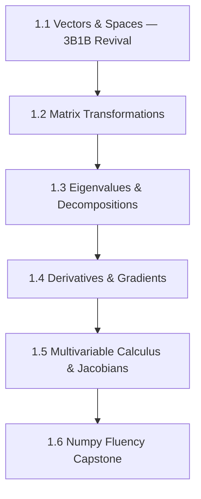

# Arc 1: Linear Algebra & Calculus

**Destination**: You have numpy fluency, can compute gradients and Jacobians by hand and in code, and have rebuilt geometric intuition for vectors, matrices, and transformations.

**Prerequisites**: None (runs concurrently with Arc 0)

**Estimated sessions**: 8–14

## The Map

## Modules

### Module 1.1: Vectors & Spaces — 3B1B Revival

> *Absorbed from main syllabus weeks 1–2: linear algebra foundations*

- **Motivation**: You watched 3B1B's Essence of Linear Algebra years ago. The intuition faded. This time you'll rebuild it with code alongside the visuals, so it sticks.
- **Implementation**: Build a `linalg_sandbox.py` with:
  - Vector operations (dot product, cross product, projection)
  - Visualization helpers (plot 2D/3D vectors, span, null space)
- **Theory backfill**: Vector spaces, linear independence, span, basis. Why these abstractions matter (they're the language of ML).
- **Exercises**:
  1. Rewatch 3B1B chapters 1–4, pause after each to implement the visualization in numpy + matplotlib
  2. Solve 10 "what does this transformation do?" problems geometrically before computing

### Module 1.2: Matrix Transformations

- **Motivation**: Every ML model is matrix multiplication. Understanding what matrices *do* geometrically is the single highest-leverage linear algebra skill.
- **Implementation**: Extend sandbox with:
  - Transformation visualization (rotation, scaling, shearing, projection)
  - Matrix composition explorer (apply A then B, see the combined effect)
- **Theory backfill**: Linear maps as matrices. Composition as multiplication. Inverses. Determinants as area/volume scaling factors.
- **Exercises**:
  1. Build an interactive 2D transformation explorer
  2. Implement image transformations (rotation, perspective) using only matrix ops
  3. Show that det(AB) = det(A) * det(B) empirically on 100 random matrix pairs

### Module 1.3: Eigenvalues & Decompositions

- **Motivation**: PCA, spectral methods, stability analysis — eigenvalues are everywhere. The geometric intuition (eigenvectors don't change direction) is the key.
- **Implementation**:
  - Power iteration for dominant eigenvalue
  - SVD from scratch (using eigendecomposition of AᵀA)
  - PCA on a real dataset (buildlog embeddings if available)
- **Theory backfill**: Characteristic polynomial. Spectral theorem for symmetric matrices. SVD as the "fundamental theorem of linear algebra."
- **Exercises**:
  1. Implement power iteration, verify against numpy.linalg.eig
  2. Use SVD to compress an image, plot reconstruction quality vs. number of singular values
  3. Run PCA on buildlog rule embeddings, visualize the top 2 components

### Module 1.4: Derivatives & Gradients

- **Motivation**: Backpropagation is just the chain rule applied systematically. If you understand gradients geometrically, neural networks stop being black boxes.
- **Implementation**:
  - Numerical differentiation (finite differences, complex step method)
  - Symbolic differentiation of simple expressions
  - Gradient descent on toy functions (Rosenbrock, Rastrigin)
- **Theory backfill**: Limits, derivatives, chain rule. Partial derivatives. The gradient as "direction of steepest ascent." Why gradient descent works (Taylor expansion argument).
- **Exercises**:
  1. Implement gradient descent from scratch, visualize the path on a contour plot
  2. Compare numerical vs. analytical gradients — when does finite difference break down?
  3. **[PUBLISH]** "The 5 gradient visualizations that made backprop click for me" (tweet thread)

### Module 1.5: Multivariable Calculus & Jacobians

- **Motivation**: The Jacobian is the multivariable generalization of the derivative. It shows up in change-of-variables (crucial for probability), neural network analysis, and physics.
- **Implementation**:
  - Jacobian computation (numerical and automatic)
  - Change-of-variables demonstrations (polar coordinates, probability transforms)
  - Hessian computation and saddle point detection
- **Theory backfill**: Total derivative. Jacobian matrix. Chain rule in multiple dimensions. Hessians and second-order information.
- **Exercises**:
  1. Compute the Jacobian of a neural network layer (y = σ(Wx + b)) by hand and verify numerically
  2. Use the change-of-variables formula to derive the PDF of a log-normal from a normal
  3. Find and classify critical points of a 2D function using the Hessian

### Module 1.6: Numpy Fluency Capstone

- **Motivation**: Fluency means you think in array operations, not loops. This module is pure practice.
- **Implementation**: Solve 20 numpy exercises covering:
  - Broadcasting, fancy indexing, structured arrays
  - Vectorized implementations of algorithms from earlier modules
  - Memory layout and performance (C vs Fortran order, views vs copies)
- **Theory backfill**: None — this is skills practice.
- **Exercises**:
  1. Rewrite all previous module implementations using idiomatic numpy (no Python loops)
  2. **[PUBLISH]** Publishable notebook: "Linear algebra you actually need for ML engineering" — visual, practical, code-forward
  3. Benchmark: loop vs. vectorized implementations on increasingly large inputs

## Publication Checkpoints

| # | Artifact | Type | Audience | Template |
|---|----------|------|----------|----------|
| 1 | "The 5 gradient visualizations that made backprop click for me" | Tweet thread | Practitioners (Twitter/LinkedIn) | Module 1.4 exercise 3 → edit → publish |
| 2 | "Linear algebra you actually need for ML engineering" | Notebook/Blog | Technical | Module 1.6 exercise 2 → edit → publish |

## Implementation Targets

- **buildlog**: PCA visualization of rule embeddings (if embedding backend is available)
- **standalone**: `linalg_sandbox.py` notebook — educational artifact

## Resources

### Books
- Strang, *Introduction to Linear Algebra* — reference (Modules 1.1–1.3)
- Axler, *Linear Algebra Done Right* — for when you want the abstract version

### Videos
- 3Blue1Brown, *Essence of Linear Algebra* (YouTube) — primary resource (Modules 1.1–1.3)
- 3Blue1Brown, *Essence of Calculus* (YouTube) — (Modules 1.4–1.5)

### Online
- numpy 100 exercises (Module 1.6)
