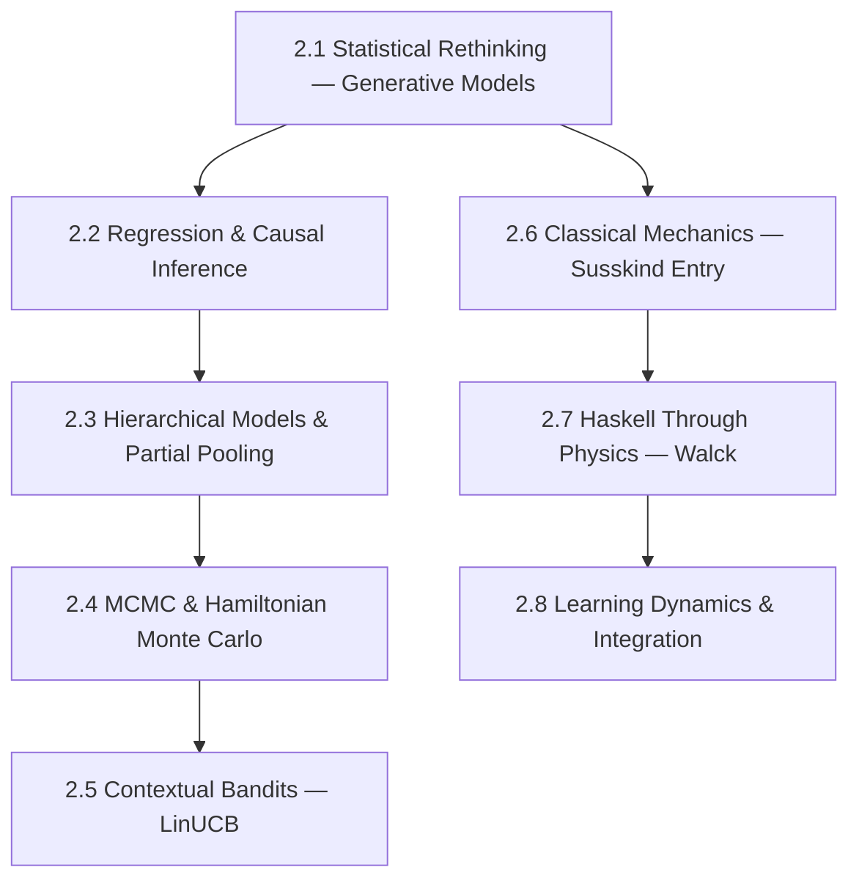

# Arc 2: Bayesian Inference & Physics

**Destination**: You can build hierarchical Bayesian models, implement contextual bandits (LinUCB), read McElreath's Statistical Rethinking fluently, and have entered Haskell through physics simulation.

**Prerequisites**: Arc 0 (Probabilistic Foundations), Arc 1 (Linear Algebra & Calculus)

**Estimated sessions**: 16–24

## The Map

## Modules

### Module 2.1: Statistical Rethinking — Generative Models

> *Absorbed from emergent-salience weeks 4–5: Bayesian modeling, generative thinking*

- **Motivation**: McElreath's approach — start with a generative story, then build the model — is exactly how buildlog should reason about rule effectiveness. Rules don't just "work" or "not work." They work *in context*, for *certain agents*, on *certain tasks*.
- **Implementation**: Work through Statistical Rethinking chapters 1–6:
  - Build generative models for rule effectiveness
  - Simulate data from the model, check that the model can recover known parameters
  - Use `pymc` or `numpyro` for inference
- **Theory backfill**: DAGs and causal models. Generative vs. discriminative thinking. Why simulation before inference.
- **Exercises**:
  1. Build a generative model for buildlog: P(outcome | rule, agent, task_type)
  2. Simulate 1000 experiments from the model, verify the inference recovers true parameters
  3. Identify confounds in current buildlog experiment design using DAGs

### Module 2.2: Regression & Causal Inference

- **Motivation**: "Does this rule help?" is a causal question. Regression gives you the machinery to answer it while controlling for confounds.
- **Implementation**: Statistical Rethinking chapters 4–7:
  - Linear regression as Bayesian model
  - Multiple regression and confounding
  - Interaction effects
- **Theory backfill**: Why regression coefficients aren't causal. The four elemental confounds (fork, pipe, collider, descendant). Backdoor criterion.
- **Exercises**:
  1. Model buildlog RMR as a function of rule count, agent type, and task complexity
  2. Identify a Simpson's paradox in buildlog data (or simulate one)
  3. **[PUBLISH]** "What agent tooling has in common with classical mechanics" — the Lagrangian as optimization over paths, bandits as optimization over policies

### Module 2.3: Hierarchical Models & Partial Pooling

> *Absorbed from emergent-salience week 5: hierarchical structure, partial pooling*

- **Motivation**: Rules have different effectiveness across agents. Complete pooling (one global estimate) ignores this. No pooling (separate estimate per agent) wastes data. Partial pooling is the Bayesian answer.
- **Implementation**:
  - Hierarchical model for rule effectiveness across agents
  - Shrinkage estimation and the James-Stein connection
  - Extend buildlog bandit with hierarchical structure
- **Theory backfill**: Statistical Rethinking chapters 13–14. Multilevel models. Varying slopes and intercepts. Why partial pooling is regularization.
- **Exercises**:
  1. Build hierarchical bandit: agent-level rule effectiveness with population-level shrinkage
  2. Compare: no pooling vs. complete pooling vs. partial pooling on simulated multi-agent data
  3. **[PUBLISH]** Code: buildlog hierarchical model PR or Agno BanditStore extension

### Module 2.4: MCMC & Hamiltonian Monte Carlo

- **Motivation**: Beyond conjugate priors, you need MCMC. HMC (and NUTS) is the workhorse of modern Bayesian inference. Understanding it means understanding why Stan/PyMC work and when they don't.
- **Implementation**:
  - Metropolis-Hastings from scratch
  - HMC from scratch (leapfrog integrator, the connection to Hamiltonian mechanics)
  - Diagnostics: R-hat, ESS, trace plots, divergences
- **Theory backfill**: Markov chains and stationarity. Detailed balance. Hamiltonian dynamics (this connects to Module 2.6). Why gradients make HMC efficient.
- **Exercises**:
  1. Implement Metropolis-Hastings, visualize acceptance rate vs. step size
  2. Implement HMC, show it outperforms MH on a correlated 2D Gaussian
  3. Diagnose a pathological model (Neal's funnel) — observe divergences, fix with reparameterization

### Module 2.5: Contextual Bandits — LinUCB

> *Absorbed from emergent-salience week 6: contextual bandits, feature engineering*

- **Motivation**: buildlog's current bandit ignores context (error_class is the only feature). LinUCB uses features — task type, agent, file type — to select rules more intelligently.
- **Implementation**:
  - LinUCB from scratch (the ridge regression connection)
  - Feature engineering for buildlog context (error_class, agent_id, file_type, session_length)
  - A/B test: Thompson Sampling vs. LinUCB on buildlog data
- **Theory backfill**: Contextual bandits as online learning. LinUCB as linear ridge regression with UCB exploration. Regret bounds.
- **Exercises**:
  1. Implement LinUCB, verify on synthetic contextual data
  2. Design the feature vector for buildlog contexts
  3. **[PUBLISH]** Tutorial series part 3: "From bandits to contextual bandits"

### Module 2.6: Classical Mechanics — Susskind Entry

- **Motivation**: Hamiltonian mechanics isn't just physics — it's the mathematical framework underlying HMC, variational inference, and geometric mechanics. Susskind's *Theoretical Minimum* is the gentlest entry.
- **Implementation**: Work through Susskind's *Classical Mechanics*, chapters 1–7:
  - Newtonian mechanics → Lagrangian → Hamiltonian
  - Phase space, Hamilton's equations
  - Poisson brackets and symmetry (Noether's theorem)
- **Theory backfill**: Principle of least action. Euler-Lagrange equations. Legendre transform (Lagrangian → Hamiltonian). Symplectic structure.
- **Exercises**:
  1. Simulate a double pendulum using Hamiltonian equations
  2. Verify energy conservation numerically (symplectic vs non-symplectic integrators)
  3. Connect: show that HMC's leapfrog integrator IS a symplectic integrator for the sampling Hamiltonian

### Module 2.7: Haskell Through Physics — Walck

- **Motivation**: Walck's *Learn Physics with Functional Programming* teaches Haskell by building physics simulations. Two birds, one stone: you get a real functional language AND deeper physics intuition.
- **Implementation**: Work through Walck, focusing on:
  - Haskell basics through mechanics (types as physical quantities, functions as laws)
  - Numerical integration in Haskell
  - Building a physics simulation library
- **Theory backfill**: Type systems as physical dimension analysis. Functional programming as mathematical function composition. Lazy evaluation for infinite series.
- **Exercises**:
  1. Implement Newton's laws in Haskell (force → acceleration → velocity → position)
  2. Build a projectile simulator with air resistance
  3. **[PUBLISH]** LinkedIn: "I learned Haskell through physics. Here's why that's not as insane as it sounds."

### Module 2.8: Learning Dynamics & Integration

- **Motivation**: Pull together the arc. Bayesian inference, physics, and bandits share deep structure. This module makes that structure explicit.
- **Implementation**:
  - Dynamics tracker v2: visualize learning dynamics as trajectories in parameter space
  - Connect Hamiltonian mechanics to HMC sampling
  - Unifying framework: learning as dynamical system
- **Theory backfill**: Learning as gradient flow. Information geometry preview (leads into Arc 3). Why the physics metaphor isn't just metaphor.
- **Exercises**:
  1. Visualize bandit learning as a trajectory in Beta parameter space
  2. Compare: gradient descent trajectory vs. HMC trajectory on the same objective
  3. **[PUBLISH]** Tutorial series parts 4–5

## Publication Checkpoints

| # | Artifact | Type | Audience | Template |
|---|----------|------|----------|----------|
| 1 | "What agent tooling has in common with classical mechanics" | Long-form | Technical/HN | Module 2.2 exercise 3 → edit → publish |
| 2 | Tutorial series parts 3–5 | Tutorial | Technical (buildlog docs) | Modules 2.5, 2.8 exercises → edit → publish |
| 3 | Hierarchical model or Agno BanditStore extension | Code | Open source | Module 2.3 exercise 3 PR |
| 4 | "I learned Haskell through physics" | LinkedIn | Practitioners/founders | Module 2.7 exercise 3 → edit → publish |

## Implementation Targets

- **buildlog**: Hierarchical bandit, LinUCB contextual bandit, dynamics tracker v2
- **Agno**: BanditStore extension (if applicable)
- **standalone**: Haskell physics simulation library

## Resources

### Books
- McElreath, *Statistical Rethinking* (2nd ed.) — primary text (Modules 2.1–2.4)
- Susskind & Hrabovsky, *The Theoretical Minimum: Classical Mechanics* — (Module 2.6)
- Walck, *Learn Physics with Functional Programming* — (Module 2.7)
- Betancourt, *Towards a Principled Bayesian Workflow* — reference (Module 2.4)

### Videos
- McElreath, *Statistical Rethinking 2024 Lectures* (YouTube) — Lectures 7–20 (Modules 2.1–2.4)
- Susskind, *Classical Mechanics* (YouTube, Theoretical Minimum series) — (Module 2.6)

### Papers
- Li et al., *A Contextual-Bandit Approach to Personalized News Article Recommendation* (2010) — LinUCB (Module 2.5)
- Neal, *MCMC Using Hamiltonian Dynamics* (2012) — (Module 2.4)

### From emergent-salience (preserved references)
- Linguistics anchors: salience in cognitive linguistics → contextual features for bandits
- Notebook refs: `notebooks/hierarchical-model.ipynb`, `notebooks/contextual-bandit.ipynb`
- Dynamics tracker: trajectory visualization in parameter space (Module 2.8)
