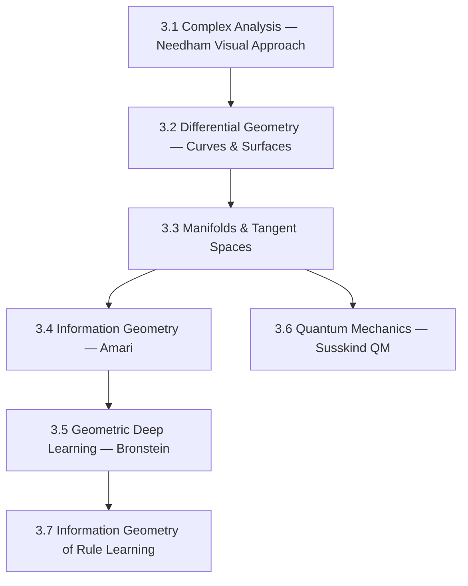

# Arc 3: Geometry & Deep Learning

**Destination**: You can read and implement geometric deep learning papers, apply information geometry to analyze rule learning, and have working intuition for differential geometry and quantum mechanics foundations.

**Prerequisites**: Arc 1 (Linear Algebra & Calculus), Arc 2 (Bayesian Inference & Physics)

**Estimated sessions**: 18–28

## The Map

## Modules

### Module 3.1: Complex Analysis — Needham Visual Approach

> *Absorbed from main syllabus weeks 5–6: Needham, complex analysis*

- **Motivation**: Needham's *Visual Complex Analysis* is the book that makes geometry feel alive. Complex numbers aren't abstract — they're rotations and scalings. This geometric intuition carries into everything that follows.
- **Implementation**:
  - Complex number visualization (Argand plane, Möbius transformations)
  - Conformal mappings and their visualizations
  - Julia sets and Mandelbrot set as iteration of complex functions
- **Theory backfill**: Needham, Chapters 1–6. Complex differentiation. Cauchy-Riemann equations as "angle-preserving" condition. Residues.
- **Exercises**:
  1. Build a conformal mapping visualizer (grid → transformed grid)
  2. Implement Möbius transformations and compose them interactively
  3. Visualize the Joukowski airfoil transform (circle → wing shape)

### Module 3.2: Differential Geometry — Curves & Surfaces

- **Motivation**: Before manifolds, build intuition with curves and surfaces in 3D. Curvature, geodesics, parallel transport — these become abstract later, but they start concrete.
- **Implementation**:
  - Curve analysis (curvature, torsion, Frenet-Serret frame)
  - Surface analysis (first and second fundamental forms)
  - Geodesic computation on simple surfaces (sphere, torus)
- **Theory backfill**: Needham, *Visual Differential Geometry and Forms* (if desired). do Carmo, *Differential Geometry of Curves and Surfaces*. Gauss's Theorema Egregium.
- **Exercises**:
  1. Compute and visualize curvature along a parametric curve
  2. Find geodesics on a sphere (great circles) and torus numerically
  3. Verify Gauss-Bonnet theorem numerically on triangulated surfaces

### Module 3.3: Manifolds & Tangent Spaces

- **Motivation**: The parameter space of a neural network is a manifold. The space of probability distributions is a manifold. To do geometry on these spaces, you need the language of manifolds.
- **Implementation**:
  - Chart and atlas construction for simple manifolds (sphere, torus)
  - Tangent vectors as derivations (abstract but implementable)
  - Riemannian metrics and distance computation
- **Theory backfill**: Topological manifolds → smooth manifolds → Riemannian manifolds. Tangent bundle. Metric tensor. Levi-Civita connection.
- **Exercises**:
  1. Implement geodesic computation on a general Riemannian manifold (using Christoffel symbols)
  2. Compute distances on the statistical manifold of Beta distributions (Fisher information metric)
  3. Visualize parallel transport on a sphere — show holonomy

### Module 3.4: Information Geometry — Amari

- **Motivation**: The Fisher information matrix defines a Riemannian metric on the space of probability distributions. This is where statistics meets geometry. For buildlog, this means the space of rule beliefs has geometry, and learning is a path through that space.
- **Implementation**:
  - Fisher information for common distributions (Bernoulli, Gaussian, Beta)
  - Statistical manifold visualization (Beta family as a 2D manifold)
  - Natural gradient descent (Amari's key insight)
- **Theory backfill**: Amari, *Information Geometry and Its Applications*, Chapters 1–5. Fisher metric. α-connections. Dually flat spaces. KL divergence as Bregman divergence.
- **Exercises**:
  1. Compute the Fisher information metric for the Beta distribution family
  2. Implement natural gradient descent, compare to ordinary gradient descent on a KL minimization problem
  3. Visualize the statistical manifold of Beta distributions with Fisher metric geodesics

### Module 3.5: Geometric Deep Learning — Bronstein

> *Absorbed from main syllabus weeks 7–8: geometric deep learning*

- **Motivation**: Bronstein et al.'s "Geometric Deep Learning" blueprint unifies CNNs, GNNs, Transformers as instances of a single geometric principle: equivariance to symmetry groups.
- **Implementation**:
  - Implement a simple GNN (message passing)
  - Implement group equivariant convolution
  - Apply to a buildlog-relevant task (rule similarity graph, code structure graph)
- **Theory backfill**: Bronstein et al., *Geometric Deep Learning: Grids, Groups, Graphs, Geodesics, and Gauges*. Symmetry groups. Equivariance. The five G's.
- **Exercises**:
  1. Implement message-passing GNN from scratch in PyTorch
  2. Show that a standard CNN is equivariant to translation but not rotation
  3. **[PUBLISH]** Technical piece: "Information geometry of rule learning" — the serious one

### Module 3.6: Quantum Mechanics — Susskind QM

- **Motivation**: Quantum mechanics is linear algebra and complex analysis meeting physics. Susskind's approach (state vectors, operators, measurement) connects directly to the math you've built. Plus: quantum computing is coming, and this is the foundation.
- **Implementation**: Work through Susskind's *Quantum Mechanics: The Theoretical Minimum*:
  - State vectors in Hilbert space
  - Operators and measurement
  - Spin-1/2 systems (the simplest quantum system)
  - Entanglement and Bell's inequality
- **Theory backfill**: Dirac notation. Hermitian operators. Eigenvalue problems in QM. Uncertainty principle from non-commuting operators.
- **Exercises**:
  1. Simulate a qubit (state vector, measurement probabilities, unitary gates)
  2. Verify Bell's inequality violation with a quantum simulation
  3. Connect: show that quantum state tomography is a statistical estimation problem (links back to Arc 0)

### Module 3.7: Information Geometry of Rule Learning

- **Motivation**: This is the capstone. Apply information geometry to buildlog's rule learning problem. The space of rule beliefs is a statistical manifold. Learning trajectories are paths on this manifold. Can we use geometric insights to improve the bandit?
- **Implementation**:
  - Map buildlog's Beta-Bernoulli model onto the statistical manifold
  - Compute and visualize learning trajectories with Fisher metric
  - Natural gradient bandit: update rules using natural gradient instead of standard gradient
  - Compare geometric vs. standard learning dynamics
- **Theory backfill**: Synthesis of Modules 3.3–3.5 applied to the buildlog domain.
- **Exercises**:
  1. Build geometric analysis tooling for buildlog
  2. Run experiment: natural gradient bandit vs. Thompson Sampling
  3. **[PUBLISH]** Code: geometric analysis tooling PR for buildlog

## Publication Checkpoints

| # | Artifact | Type | Audience | Template |
|---|----------|------|----------|----------|
| 1 | "Information geometry of rule learning" | Technical piece | Technical/research | Module 3.5 exercise 3 + Module 3.7 → edit → publish |
| 2 | Geometric analysis tooling for buildlog | Code | Open source | Module 3.7 exercise 3 PR |
| 3 | Conference-track material (if warranted) | Research | Academic/research | Module 3.7 analysis → write-up |

## Implementation Targets

- **buildlog**: Geometric analysis tooling, natural gradient bandit variant, Fisher metric visualization
- **standalone**: Complex analysis visualizer, GNN implementation

## Resources

### Books
- Needham, *Visual Complex Analysis* — (Module 3.1)
- Needham, *Visual Differential Geometry and Forms* — (Module 3.2)
- Amari, *Information Geometry and Its Applications* — (Module 3.4)
- Bronstein et al., *Geometric Deep Learning* (monograph) — (Module 3.5)
- Susskind & Friedman, *Quantum Mechanics: The Theoretical Minimum* — (Module 3.6)

### Videos
- Susskind, *Quantum Mechanics* (YouTube, Theoretical Minimum series) — (Module 3.6)

### Papers
- Bronstein et al., *Geometric Deep Learning: Grids, Groups, Graphs, Geodesics, and Gauges* (2021) — (Module 3.5)
- Amari, *Natural Gradient Works Efficiently in Learning* (1998) — (Module 3.4)
