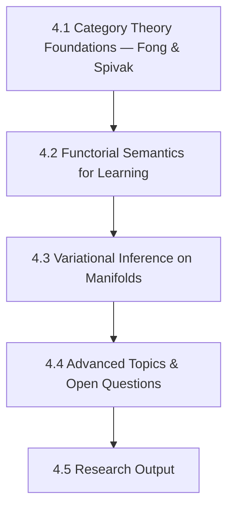

# Arc 4: Research Frontier

**Destination**: You can read and engage with research at the intersection of category theory, variational inference, and differential geometry. You have the mathematical maturity to formulate open questions and produce research-grade writing.

**Prerequisites**: Arc 2 (Bayesian Inference & Physics), Arc 3 (Geometry & Deep Learning)

**Estimated sessions**: 20–30+

## The Map

## Modules

### Module 4.1: Category Theory Foundations — Fong & Spivak

> *Absorbed from main syllabus weeks 9–10: category theory entry*

- **Motivation**: Category theory is the "mathematics of mathematics." Fong & Spivak's *An Invitation to Applied Category Theory* is the gentlest entry — it starts with concrete examples (databases, circuits, signal flow) before abstraction.
- **Implementation**: Work through Fong & Spivak:
  - Categories, functors, natural transformations
  - Monoidal categories and string diagrams
  - Enriched categories and profunctors
- **Theory backfill**: Chapters 1–5 of Fong & Spivak. Focus on the "Seven Sketches" approach — each chapter is a different application.
- **Exercises**:
  1. Model buildlog's rule pipeline as a category (objects = data types, morphisms = transformations)
  2. Draw the string diagram for the capture → extract → select → measure → learn pipeline
  3. Identify the functor from "buildlog internal representation" to "agent config format" (the multi-agent rendering)

### Module 4.2: Functorial Semantics for Learning

- **Motivation**: Can we formalize "learning" categorically? The bandit's update rule is a morphism. The prior-to-posterior map is a functor. Making this precise might reveal structure we're missing.
- **Implementation**:
  - Formalize Beta-Bernoulli updating as a functor
  - Para construction for parameterized learning (Gavranović et al.)
  - Lenses and optics for bidirectional data flow (forward pass / backward pass)
- **Theory backfill**: Categorical probability (Fritz, Rischel). Para construction. Polynomial functors.
- **Exercises**:
  1. Implement the Para construction in Python/Haskell for a simple learning system
  2. Show that Thompson Sampling is a natural transformation (or argue why it isn't)
  3. Model the experiment pipeline (hypothesis → data → posterior → decision) as a lens

### Module 4.3: Variational Inference on Manifolds

- **Motivation**: When conjugate priors aren't available, you need variational inference. When the parameter space has geometry (and it always does), you should respect that geometry. This is where information geometry meets practical Bayesian computation.
- **Implementation**:
  - Variational inference from scratch (ELBO, reparameterization trick)
  - Riemannian optimization (gradient descent on manifolds)
  - Variational inference that respects the Fisher metric
- **Theory backfill**: KL divergence and ELBO. Riemannian gradient descent. Connections to natural gradient (Arc 3 callback). Black-box variational inference.
- **Exercises**:
  1. Implement BBVI (black-box variational inference) from scratch
  2. Compare: Euclidean VI vs. Riemannian VI on a curved statistical manifold
  3. Apply to a buildlog model that's too complex for conjugate updates

### Module 4.4: Advanced Topics & Open Questions

- **Motivation**: At this point, you're at the frontier. The goal shifts from "learn known material" to "formulate questions nobody has answered."
- **Topics** (choose based on where the work leads):
  - Categorical foundations of active inference
  - Geometric methods for non-stationary bandits
  - Compositional game theory and multi-agent learning
  - Topological data analysis for rule similarity
  - Sheaf theory for distributed learning systems
- **Exercises**:
  1. Write a research proposal: what question would you investigate if you had 6 months?
  2. Implement a proof-of-concept for one advanced topic
  3. Present findings to a technical audience (blog post, talk, or workshop paper)

### Module 4.5: Research Output

- **Motivation**: The arc ends with production. Not "I learned a thing" but "I produced a thing others can use."
- **Implementation**:
  - Write up the strongest finding from this arc
  - Target a venue (workshop paper, technical blog, arxiv preprint — TBD based on what the work produces)
  - Get feedback from domain experts
- **Exercises**:
  1. **[PUBLISH]** Research-grade writing — venue and format TBD
  2. **[PUBLISH]** Open-source code artifact from the research

## Publication Checkpoints

| # | Artifact | Type | Audience | Template |
|---|----------|------|----------|----------|
| 1 | Research-grade writing | Research paper/preprint | Academic/research | Module 4.5 exercise 1 |
| 2 | Open-source code artifact | Code | Research community | Module 4.5 exercise 2 |
| 3 | Technical blog distillation | Long-form | Technical/HN | Distilled version of research output |

## Implementation Targets

- **buildlog**: Advanced bandit variants, compositional pipeline formalization
- **research**: Standalone research artifacts, potential arxiv submission
- **Haskell**: Category theory implementations (natural fit for the language)

## Resources

### Books
- Fong & Spivak, *An Invitation to Applied Category Theory: Seven Sketches in Compositionality* — primary text (Module 4.1)
- Riehl, *Category Theory in Context* — reference (deeper than Fong & Spivak)
- Mac Lane, *Categories for the Working Mathematician* — the classic (when ready)

### Papers
- Gavranović et al., *Categorical Foundations of Gradient-Based Learning* (2024) — (Module 4.2)
- Fritz, *A Synthetic Approach to Markov Kernels, Conditional Independence and Theorems on Sufficient Statistics* (2020) — categorical probability
- Bronstein et al., *Geometric Deep Learning* (2021) — continued from Arc 3

### Videos
- Bartosz Milewski, *Category Theory for Programmers* (YouTube) — supplementary (Module 4.1)
