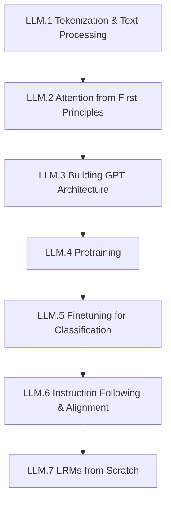

# Arc LLM: Language Model Internals (Companion Track)

**Destination**: You can trace the full pipeline from raw text to aligned instruction-following model — tokenization, attention, pretraining, finetuning, alignment — and implement each stage from scratch.

**Prerequisites**: None (runs alongside main arcs)

**Primary text**: Raschka, *Build a Large Language Model (From Scratch)*

**Estimated sessions**: 10–14

## Suggested Pacing

This companion arc is designed to sync with the main curriculum arcs:

- **LLM.1–2** alongside **Arc 1** (linear algebra provides the foundation for attention math — matrix multiplications, projections, softmax)
- **LLM.3–4** alongside **Arc 2** (Bayesian thinking informs training evaluation — loss curves, convergence diagnostics, model comparison)
- **LLM.5–6** after **Arc 0 Modules 0.5–0.6** (hypothesis testing and bootstrap methods for rigorous model comparison and finetuning evaluation)

## The Map

## Modules

### Module LLM.1: Tokenization & Text Processing

> *Raschka Ch 1–2*

- **Motivation**: Every LLM starts with turning text into numbers. The tokenizer is the first bottleneck and the first design decision. Get this wrong and nothing downstream can fix it.
- **Implementation**: Build a tokenizer pipeline from scratch:
  - Character-level and word-level tokenization baselines
  - Byte-pair encoding (BPE) implementation
  - Vocabulary construction and special tokens
  - Text-to-token-ID pipeline with encoding/decoding roundtrips
- **Theory backfill**: Information-theoretic view of tokenization — compression, vocabulary size tradeoffs. Why subword tokenization dominates. Relationship between tokenizer and model capacity.
- **Exercises**:
  1. Implement BPE from scratch, train on a small corpus, compare vocabulary to tiktoken
  2. Measure compression ratios across different tokenization strategies
  3. Build a data loading pipeline that produces token batches for training

### Module LLM.2: Attention from First Principles

> *Raschka Ch 3*

- **Motivation**: Attention is the mechanism that lets a model decide what to look at. It's the core innovation that makes transformers work. You need to understand it as matrix math, not just as a diagram.
- **Implementation**: Build attention step by step:
  - Dot-product similarity and scaled dot-product attention
  - Query, key, value projections from embeddings
  - Single-head attention with masking
  - Multi-head attention with concatenation and output projection
  - Causal (autoregressive) masking
- **Theory backfill**: Attention as soft dictionary lookup. Why scaling by sqrt(d_k). Connection to kernel methods. Computational complexity of self-attention (O(n^2)).
- **Exercises**:
  1. Implement single-head and multi-head attention from raw matrix operations (no nn.MultiheadAttention)
  2. Visualize attention patterns on example sequences — which tokens attend to which?
  3. **[PUBLISH]** "Attention as salience scoring" — connecting transformer attention to the salience framework from Arc 0 Module 0.1

### Module LLM.3: Building GPT Architecture

> *Raschka Ch 4*

- **Motivation**: You have attention. Now stack it into a real architecture. By the end of this module, you have a GPT that can forward-pass — it just has random weights.
- **Implementation**: Assemble a GPT-style transformer:
  - Token + positional embeddings
  - Transformer block: layer norm, multi-head attention, feed-forward, residual connections
  - Stacking blocks into a full model
  - Text generation with temperature and top-k sampling
- **Theory backfill**: Why residual connections prevent gradient vanishing. Layer norm vs batch norm. The role of the feed-forward network (per-token nonlinear transformation). Why GPT is decoder-only.
- **Exercises**:
  1. Build the full GPT architecture, verify shapes at every layer
  2. Load pretrained GPT-2 weights into your architecture, confirm matching outputs
  3. Generate text with different temperature and top-k settings, explain the tradeoffs

### Module LLM.4: Pretraining

> *Raschka Ch 5*

- **Motivation**: Architecture without training is just a random number generator with good taste in matrix shapes. Pretraining is where the model learns language.
- **Implementation**: Build a pretraining pipeline:
  - Cross-entropy loss for next-token prediction
  - Training loop with AdamW, learning rate scheduling, gradient clipping
  - Training/validation loss tracking and convergence diagnostics
  - Checkpoint saving and resumption
- **Theory backfill**: Maximum likelihood estimation as the objective. Why cross-entropy. Learning rate warmup and cosine decay — why these schedules work. Gradient accumulation for effective batch size.
- **Exercises**:
  1. Pretrain your GPT on a small corpus (e.g., a single book), track loss curves
  2. Diagnose training — identify overfitting, tune hyperparameters, compare runs
  3. Generate text from your pretrained model, compare quality at different training stages

### Module LLM.5: Finetuning for Classification

> *Raschka Ch 6*

- **Motivation**: A pretrained model knows language but not your task. Finetuning adapts general knowledge to specific problems — classification, sentiment, spam detection.
- **Implementation**: Build a finetuning pipeline for classification:
  - Replace the output head for classification
  - Dataset preparation and label encoding
  - Finetuning loop with frozen/unfrozen layers
  - Evaluation metrics: accuracy, precision, recall, confusion matrix
- **Theory backfill**: Transfer learning — why finetuning works (features are reusable). Catastrophic forgetting and how freezing layers mitigates it. When to finetune vs. prompt.
- **Exercises**:
  1. Finetune your pretrained model on a sentiment classification task
  2. Compare performance with different amounts of frozen layers
  3. Run a bootstrap comparison (Arc 0 Module 0.6) between finetuned model and a simple baseline

### Module LLM.6: Instruction Following & Alignment

> *Raschka Ch 7*

- **Motivation**: A model that predicts the next token isn't the same as a model that follows instructions. Alignment is the bridge from "language model" to "useful assistant."
- **Implementation**: Build an alignment pipeline:
  - Instruction dataset formatting (prompt/completion pairs)
  - Supervised finetuning (SFT) on instruction data
  - Reward model basics — scoring outputs for helpfulness
  - Direct preference optimization (DPO) or RLHF introduction
- **Theory backfill**: The alignment problem in concrete terms. Why SFT alone isn't enough. Reward hacking. KL divergence penalties to prevent mode collapse. RLHF vs DPO tradeoffs.
- **Exercises**:
  1. Fine-tune your model on an instruction-following dataset
  2. **[PUBLISH]** "Reward signals for language models" — connecting reward modeling to Thompson Sampling reward signals from Arc 0 Module 0.7
  3. Compare SFT-only vs SFT+DPO outputs qualitatively and quantitatively

### Module LLM.7: LRMs from Scratch

> *Extension — reasoning models*

- **Motivation**: Instruction-following models complete tasks. Reasoning models think through problems step by step. This is the frontier — building models that reason, not just respond.
- **Implementation**: Explore reasoning model techniques:
  - Chain-of-thought prompting and its limitations
  - Training with reasoning traces (process reward models)
  - Verification and self-consistency
  - Search-augmented generation (tree of thought, Monte Carlo tree search)
- **Theory backfill**: Why autoregressive generation struggles with planning. Process vs outcome reward models. The connection between MCTS and Thompson Sampling (exploration-exploitation in reasoning). Scaling inference-time compute.
- **Exercises**:
  1. Implement chain-of-thought generation with self-consistency (majority voting)
  2. Build a simple process reward model that scores intermediate reasoning steps
  3. Compare outcome-based vs process-based reward on a math reasoning benchmark

## Publication Checkpoints

| # | Artifact | Type | Source Module |
|---|----------|------|---------------|
| 1 | "Attention as salience scoring" | Blog post | LLM.2 Exercise 3 |
| 2 | "Reward signals for language models" | Blog post | LLM.6 Exercise 2 |

## Future Extensions

- **Domain-Specific SLMs**: Training small language models for specialized domains (legal, medical, code)
- **Rearchitecting LLMs**: State-space models (Mamba), mixture of experts, alternative attention mechanisms

## Resources

### Books
| Book | Author(s) | Chapters/Sections | Notes |
|------|-----------|-------------------|-------|
| *Build a Large Language Model (From Scratch)* | Raschka | Full | Primary text for all modules |

### Papers
- Vaswani et al., *Attention Is All You Need* (2017) — foundational transformer paper (Module LLM.2)
- Radford et al., *Language Models are Unsupervised Multitask Learners* (2019) — GPT-2 paper (Modules LLM.3–4)
- Ouyang et al., *Training language models to follow instructions with human feedback* (2022) — InstructGPT/RLHF (Module LLM.6)
- Rafailov et al., *Direct Preference Optimization* (2023) — DPO as RLHF alternative (Module LLM.6)
